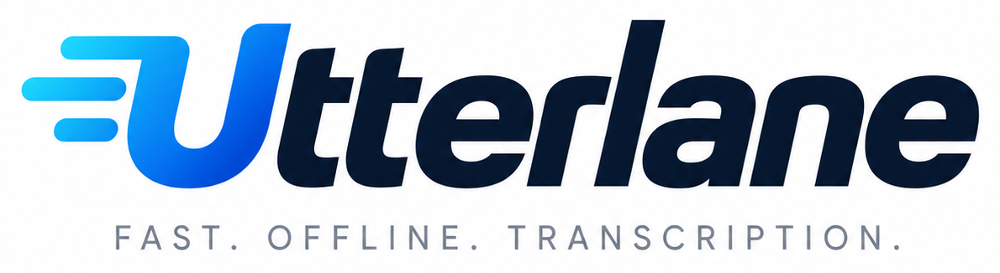
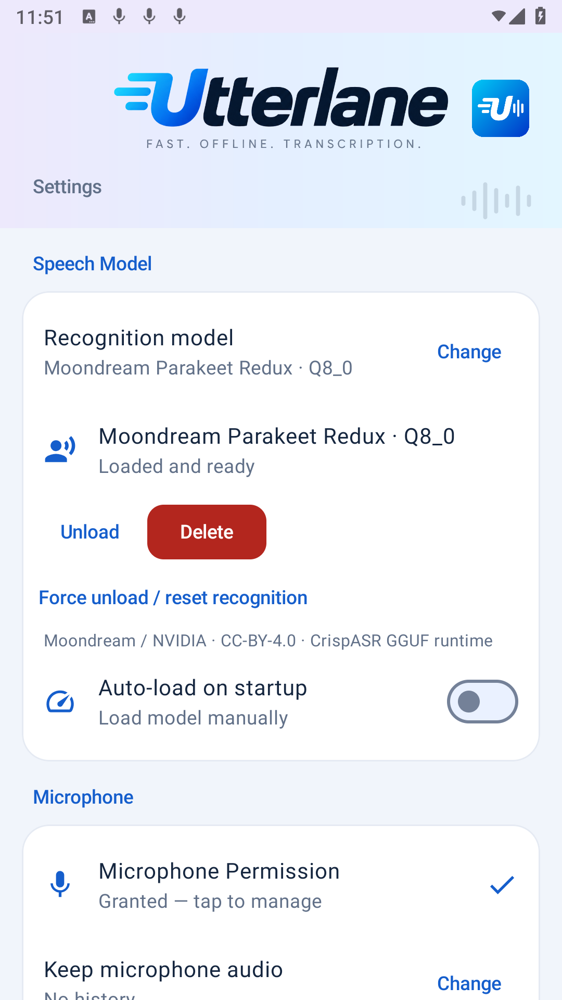
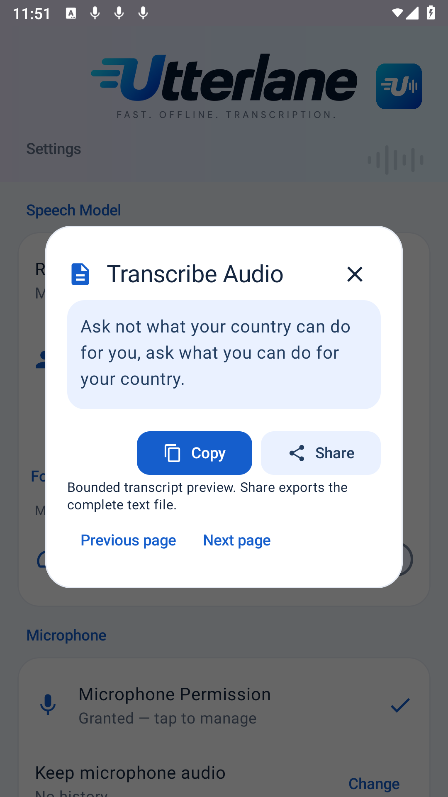

<p align="center">
  
</p>

<p align="center">
  <strong>Speak naturally. Get text as you go. Keep speech recognition on your device.</strong>
</p>

<p align="center">
  <a href="https://github.com/lrq3000/Utterlane/actions/workflows/build_apk.yml"></a>
  <a href="LICENSE"></a>
  
  
</p>

<p align="center">
  <a href="https://github.com/lrq3000/Utterlane/releases/latest"></a>
  <a href="https://apps.obtainium.imranr.dev/redirect?r=obtainium://add/https://github.com/lrq3000/Utterlane"></a>
  <a href="#store-availability"></a>
  <a href="#store-availability"></a>
</p>

<p align="center">
  <a href="#get-started">Get started</a> ·
  <a href="#features">Features</a> ·
  <a href="#privacy">Privacy</a> ·
  <a href="#build-from-source">Build</a> ·
  <a href="#contributing">Contribute</a> ·
  <a href="#lineage-and-maintenance">Lineage</a>
</p>

Utterlane is an open-source **offline voice-typing and audio-transcription app for
Android**, built around responsive capture and incremental output. Dictate into
other apps, use your keyboard's microphone button, or turn a shared voice message
into text. No account, subscription, or speech-recognition server is required.

**Automatically multilingual:** Utterlane detects the language you speak and can
transcribe **multiple languages in the same recording**, with no manual language
switching—all offline.

## Get started

### Install

Use an **Android 8.0+ device with ARM64 support** and leave room for a speech model
(approximately 159–674 MB for the catalog models; custom models vary).

**Direct APK:** open [GitHub Releases](https://github.com/lrq3000/Utterlane/releases/latest),
download `Utterlane-<version>-arm64-v8a.apk` from **Assets**, and open it to install.
If Android asks, allow installation from your browser/file manager. Use the APK;
the `.aab` is a Google Play upload artifact and cannot be installed directly.
The release APK becomes available after the maintainer publishes the first signed
release; until then, you can [build from source](#build-from-source).

**Automatic update tracking with [Obtainium](https://github.com/ImranR98/Obtainium):**
tap the Obtainium button above, or open **Add app** and enter
`https://github.com/lrq3000/Utterlane`. Select the ARM64 release APK if prompted,
then add/install the app. Obtainium tracks new releases from this repository.

**[Komi Store](https://github.com/komi-store/komi-store):** search for
`lrq3000/Utterlane`, open the matching GitHub project, and select its Android APK
release. The maintainer is **lrq3000** and the application ID is
`io.github.lrq3000.utterlane`. A published release with an APK asset is needed
before installation is possible.

#### Store availability

Publication on **F-Droid** and **Google Play (free)** is planned. The buttons above
are status links, not claims that either listing is already available. Once
published, search for **Utterlane** in the official F-Droid repository or Google
Play and verify the application ID. Maintainers: follow the
[release and store submission guide](docs/distribution/README.md).

GitHub/Obtainium/Komi Store use the same developer-signed APK. An F-Droid build
normally has an F-Droid signature, and Google Play may use a separate Play App
Signing key. Switching between differently signed builds requires uninstalling
the old app first, which removes its private data. Export anything you need first.

Utterlane uses the application ID `io.github.lrq3000.utterlane`. It installs
separately from its predecessor: settings, model files, recording history, and
permissions do not migrate automatically. Store publishing under this new
identity is separate from upstream distribution; the presence of Fastlane
metadata does not mean a Google Play or F-Droid listing is live.

### Your first dictation

1. Open **Utterlane** and select a recognition model.
2. **Download the model**, or **Import from folder** if you already have the
   required files. Once installed, recognition works without a network connection.
3. Grant **Microphone** access.
4. Choose your input method:
   - **Keyboard mic:** open **Keyboard Integration → Voice Input Method**, enable
     Utterlane, and enable the voice-input key in a compatible keyboard such as
     [HeliBoard](https://github.com/Helium314/HeliBoard).
   - **Accessibility button:** enable Utterlane's text-input accessibility service
     in Android Settings to insert recognized text into the focused field.
   - **Floating mic:** allow **Display over other apps** and enable the floating
     button in Utterlane.
5. Focus a text field, tap the microphone, and speak. Tap the recording panel to
   finish. If text cannot be inserted, Utterlane can use the clipboard or provide
   transcript recovery/export.

**Already have an audio file?** Share it with Utterlane or choose **Open with →
Utterlane** in your file manager. You can also monitor selected folders for newly
saved voice messages.

## Features

| | What you can do |
| --- | --- |
| **On-device recognition** | Run NVIDIA Parakeet v3 or optional Moondream Parakeet Ultra/Redux models locally. |
| **Incremental text** | Receive completed speech segments while microphone capture continues; see file-transcription results before the whole file finishes. |
| **System-wide input** | Use a keyboard microphone, accessibility button, or draggable floating microphone. |
| **Voice-message transcription** | Share, open, or monitor audio files including OPUS, AAC, OGG, M4A, MP3, and WAV, subject to device codec support. |
| **Automatic multilingual transcription** | Recognize 25 languages automatically and mix supported languages in the same recording without changing settings. A multilingual user interface is also available. |
| **Word corrections** | Fix recurring names and recognition mistakes with your own whole-word replacement rules. |
| **Optional local history** | Replay, share, delete, or retranscribe saved microphone recordings with configurable retention. Off by default. |
| **Long-session handling** | Bounded audio queues, chunked decoding, cancellation, and recoverable completed transcripts. |
| **Live feedback** | Audio-driven waveform, low/no-signal feedback, processing progress, and an estimated remaining time after stopping. |
| **Model recovery** | Unload/reset recognition without force-closing the app if a model fails or becomes stuck. |
| **Automatic model unloading** | Free model memory after configurable inactivity; defaults to 20 minutes. |

### Model memory

In **Speech Model → Idle time before unload**, choose **Immediate**, **5 min**,
**20 min** (default), **1 h**, **3 h**, **24 h**, or **Never**. The idle countdown
starts after the last transcription finishes or is cancelled, or after loading
a model without transcribing. Active recording and processing keep the model
loaded. Changing the timeout applies to the time already spent idle.

Unloading keeps downloaded model files and microphone services available; the
next transcription reloads the model automatically. **Immediate** also skips
startup auto-loading. **Never** disables this automatic unloading, although
Android can still reclaim the app process. Sleep counts toward inactivity;
expired deadlines are rechecked when the device wakes without waking it solely
to unload the model.

### A closer look

<p align="center">
  
  
</p>

### How streaming works

Utterlane processes microphone audio while capture continues and delivers
completed text segments. The default Parakeet v3 backend uses **simulated
streaming over an offline model**, with context around bounded windows of at most
12 seconds per inference call. This is segment-by-segment output, not a promise
of instantaneous word-by-word results. Latency depends on pauses, model, and
device speed; recognition near segment boundaries can differ from a single
whole-recording pass.

With history disabled, microphone audio stays in bounded memory queues. If the
device cannot keep up, recording stops visibly and accepted audio finishes
processing. With history enabled, recordings also provide a disk-backed backlog.
Optional audio history is approximately **115 MB per hour**, split into hourly
PCM16 WAV parts. Retention ranges from one hour to forever; Android can delay
background cleanup while asleep or force-stopped.

### Models and languages

Speak naturally in any of the 25 supported languages—Utterlane detects the
language automatically. You can even **switch languages within a single
recording**: start speaking **English**, continue in **French**, then switch to
**Spanish**. Utterlane transcribes each part in its spoken language without
requiring you to select a language or restart the recording.

| Model | Runtime | Approximate model download |
| --- | --- | --- |
| NVIDIA Parakeet TDT v3 | sherpa-onnx / ONNX INT8 | 670 MB |
| Moondream Parakeet Ultra — Q8_0 is the first-launch default | CrispASR / GGUF Q8_0 or Q4_K | 674 MB or 402 MB |
| Moondream Parakeet Redux | CrispASR / GGUF Q8_0 or Q4_K | 674 MB or 402 MB |
| Moondream Parakeet Redux — compact native ternary | transcribe.cpp / TQ1_Q8_0 | **159.1 MB** |

The CrispASR Redux GGUF conversions are not the original 178 MB Photon packing, and
published Photon benchmarks do not establish their performance on your phone.
The Q8 alternatives have on-emulator inference coverage; Q4 variants share the
backend but have not received a separate on-device inference run.

The additional **Redux TQ1_Q8_0** option retains its ternary encoder in RAM using
transcribe.cpp's native ternary kernels. Q8_0 applies only to the remaining dense
parameters. This prioritizes compact memory over the engine's faster expanded
CPU layout. Its download is pinned and verified; it has separate storage and
does not replace the existing Redux options. Total process RAM is greater than
the download size because decoding, activations and application state also use
memory. See [native ternary QA](docs/qa/redux-native-ternary.md) for measurements.

**Custom models:** choose **Recognition model → Custom model…**, select the
CrispASR-compatible speech model and its companion files together, then choose
the main file. GGUF and legacy Whisper GGML models use CrispASR's generic session
dispatcher. For models requiring an explicit audio tokenizer/codec (such as
MiMo-ASR), assign that companion in the next step; otherwise retain automatic
sibling discovery. Original filenames are preserved in private storage; **Load** checks
native compatibility and runs a warm-up. A model supported upstream still needs
the correct converted weights, companions, and enough device memory. Missing
companions are not downloaded implicitly. TTS/music models are not speech-input
models. Custom models currently use disjoint audio chunks so models without word
timestamps cannot duplicate overlapping text.

**Speaker labels:** enable **Speaker diarization → Add speaker labels** and
download the separate NVIDIA Nemotron-3-Diarization model (107 MB), or import its
GGUF from a folder. Labels appear while microphone or imported audio is processed;
they are also included in copied/shared transcripts and text inserted into other
apps. The default is **Off**, preserving ordinary unlabeled transcription.
Choose **Auto (up to 8)** or **1–8** speakers. A specified count constrains native
arrival-order tracks; it does not force nonexistent speakers or perform an
offline global re-clustering pass. Speaker IDs belong to one recording, and
uncertain speech can be labeled **Unknown speaker**. Settings changes take effect
on the next recording. Diarization works alongside the original ONNX Parakeet v3;
no migration or replacement download of that speech model is needed.

Streaming labels are emitted at the existing audio segment boundaries, with
lookahead and additional inference work. Device throughput determines whether
processing keeps up with recording. Custom models without exposed word timings
are transcribed by speaker-turn audio slices when diarization is enabled.

**App language:** under **Appearance**, select **System (device language)**,
**English**, or any of the 23 packaged translations. The choice persists across
restarts and is independent of speech recognition language. Android 13+ also
exposes the supported languages in its system per-app language settings. New
settings use English fallback until the project's translation batch.

<details>
<summary>Supported recognition languages</summary>

Bulgarian, Croatian, Czech, Danish, Dutch, English, Estonian, Finnish, French,
German, Greek, Hungarian, Italian, Latvian, Lithuanian, Maltese, Polish,
Portuguese, Romanian, Russian, Slovak, Slovenian, Spanish, Swedish, and Ukrainian.

Language selection is automatic. Existing interface translations were
machine-generated; corrections and completion of newer strings are welcome.

</details>

### Example: saved Signal messages

In **Voice Message Transcription**, add the folder where Signal saves audio
(for example, `Music/Signal`) and enable folder monitoring. Save a voice message
from Signal to that folder; Utterlane detects it and offers transcription.

## Privacy

- Speech recognition runs locally; Utterlane does not upload audio or transcripts
  to a speech service, collect analytics, or require an account.
- Network access is used for requested model downloads from Hugging Face. Local
  model import is available; after setup, recognition works offline.
- Microphone history is **disabled by default**. When enabled, it is private to
  the app and excluded from Android cloud backup and device transfer.
- Temporary text files support long transcripts and recovery. User-requested
  exports and clipboard transfers give data to their receiving apps; those apps
  have their own privacy behavior.

See the [privacy policy](PRIVACY_POLICY.md) for retention and permission details.
Devices that support per-app network controls can also disable Utterlane's
network access after model setup.

## Build from source

### Requirements

- OpenJDK 21, Android SDK platforms 35 and 36, build tools `35.0.0`, Android NDK
  `28.2.13676358`, CMake `3.22.1` (including Ninja).
- Python 3.11.8+ and Git for pinned native-source preparation.
- AGP `8.10.1`, Kotlin `2.0.21`, and Gradle `8.12.1` via the wrapper.

Set `JAVA_HOME` and `ANDROID_HOME` to **absolute paths** for your installation.
The first build needs network access to retrieve dependencies and source code.

```bash
# Build the sherpa-onnx Kotlin/JNI AAR from pinned source.
# ONNX Runtime is a SHA-256-verified official Maven Central dependency.
python tools/build_sherpa.py

# Prepare pinned CrispASR and transcribe.cpp sources (each with its own ggml).
python tools/prepare_native.py
./gradlew assembleDebug

# Optional: install on your selected Android target.
adb -s YOUR_DEVICE_SERIAL install -r app/build/outputs/apk/debug/app-debug.apk
```

On Windows, use `gradlew.bat`; the same Python native builder works on Windows
and Linux. Build release artifacts with `./gradlew assembleRelease bundleRelease`.
They are unsigned unless the four documented signing environment variables are
provided. See the [signing guide](docs/distribution/README.md#signing-and-github-releases).

### Tests

```bash
./gradlew testDebugUnitTest assembleDebug assembleDebugAndroidTest

# After installing the app and instrumentation APK, run a focused device test.
adb -s YOUR_DEVICE_SERIAL shell am instrument -w \
  -e class io.github.lrq3000.utterlane.CapturePanelAndroidTest \
  io.github.lrq3000.utterlane.test/androidx.test.runner.AndroidJUnitRunner
```

Integration tests involving recognition require the appropriate local models
and speech fixtures; see the [QA notes](docs/qa/README.md). Use normal incremental
builds rather than clearing build caches for every test run.

### Architecture

```text
Microphone / shared file / watched folder
                  ↓
        PCM capture or audio decoding
                  ↓
    Bounded transcription windows → private recognition worker
                  ↓                    (sherpa-onnx / CrispASR)
        Custom word corrections
                  ↓
   Keyboard / focused field / transcript preview and export
```

First-party code lives in `app/src/main/java/io/github/lrq3000/utterlane/`:
`asr/` handles models and recognition, `service/` and `ime/` provide text-input
surfaces, `transcribe/` handles files, `history/` manages optional recordings,
and `settings/` and `ui/` provide the interface. Native glue is in
`app/src/main/cpp/`; [native dependency notices](app/src/main/assets/native-licenses.txt)
are also included in the APK.

## Contributing

Bug reports, translations, accessibility improvements, tests, and code are
welcome. [Open an issue](https://github.com/lrq3000/Utterlane/issues) with your app
version, Android/device details, selected model, and reproducible steps. Remove
private speech or transcript content from shared logs.

Keep changes focused and explain how you verified them. **AI contributions are
welcome as long as the outputs are sanity checked by humans.** The contributor
remains responsible for understanding the change, checking its correctness and
licensing, and testing relevant behavior. See [CONTRIBUTING.md](CONTRIBUTING.md).

Original brand artwork, generated exports, and regeneration instructions are in
the [design document](docs/design/utterlane-branding.md).

## Roadmap and known limitations

- Quick Settings tile, home-screen widget, and word-correction import/export.
- Hotword boosting when the selected recognition backend/model supports it.
- Broader physical-device performance measurements and Q4 inference coverage.
- AOSP Keyboard does not offer this voice-input integration; try a compatible
  keyboard such as HeliBoard. Upstream also reported voice-result integration
  problems with Vanadium; compatibility depends on the receiving app.

Recognition accuracy depends on speech, background noise, language, and model.
The app is provided under the warranty terms of its license.

## License and acknowledgments

Utterlane is licensed under [Apache-2.0](LICENSE). Copyright notices for upstream
contributors are retained; Utterlane contributions are copyright 2026
**Stephen Karl Larroque &lt;LRQ3000@GMAIL.COM&gt; and Utterlane contributors**.

Speech recognition builds on [NVIDIA Parakeet](https://huggingface.co/nvidia/parakeet-tdt-0.6b-v3),
[sherpa-onnx](https://github.com/k2-fsa/sherpa-onnx),
[CrispASR](https://github.com/CrispStrobe/CrispASR), and ggml. Models and third-party
libraries retain their own licenses. The default Parakeet model is CC-BY-4.0;
the ONNX conversion is provided by
[csukuangfj](https://huggingface.co/csukuangfj/sherpa-onnx-nemo-parakeet-tdt-0.6b-v3-int8).

## Lineage and maintenance

**Utterlane is a fork of [TranSlander](https://github.com/hatsch/TranSlander),
originally developed by [hatsch](https://github.com/hatsch) and its contributors.**
The upstream project began as a way to avoid touchscreen typing and transcribe
voice messages, and credited development assistance from
[Claude Code](https://claude.ai/claude-code).

This fork is now maintained by **[Stephen Karl Larroque](https://github.com/lrq3000)
([LRQ3000@GMAIL.COM](mailto:LRQ3000@GMAIL.COM))**, with a focus on responsive,
local-first transcription, incremental output, and reliable long-session handling.
The new name and application identity distinguish this independently maintained
project from upstream. Historical release links and original copyright notices
remain intact to preserve that lineage.

Human-reviewed AI contributions are welcome here, just like other contributions;
the requirement is that **humans sanity check the outputs before submission**.
