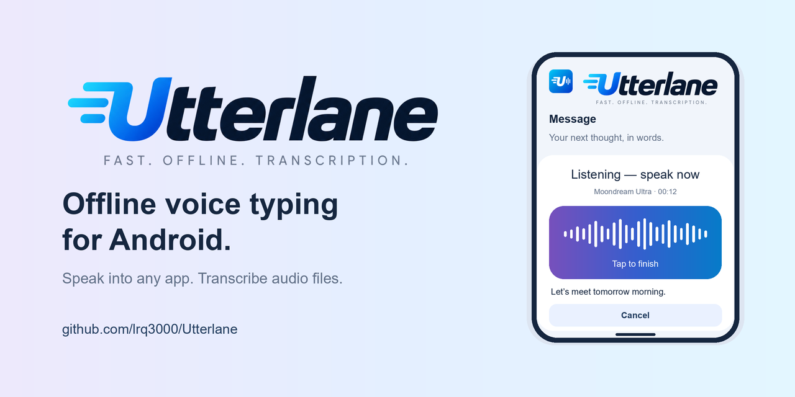
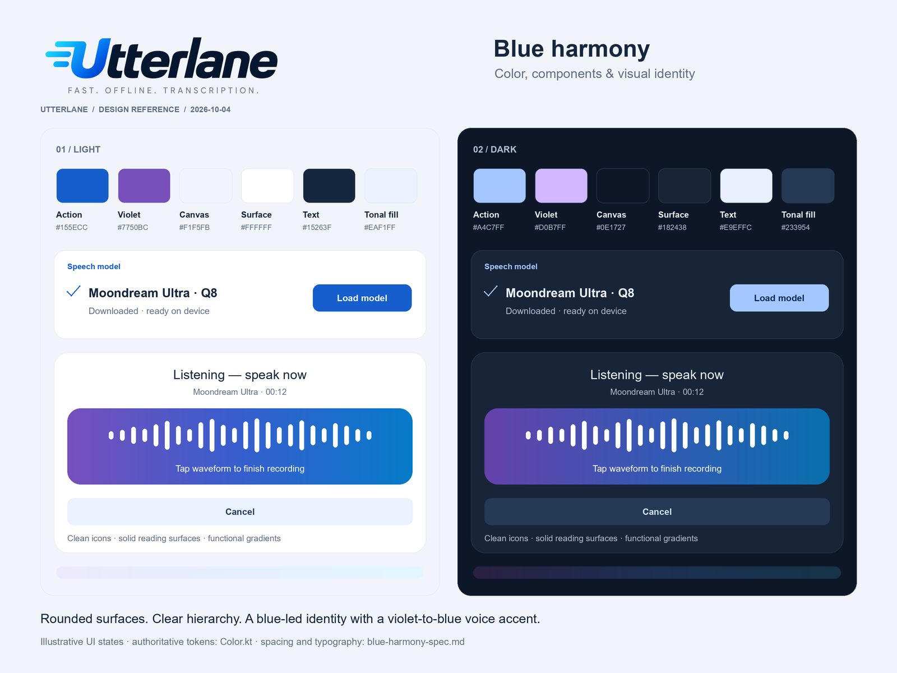

# Utterlane design kit

The **Blue harmony** identity combines the original cyan/blue Utterlane logo with
blue UI actions, subtle violet accents, and readable white/navy surfaces.

## Start here

- [Design specification](blue-harmony-spec.md): identity, exact colors, typography,
  spacing, components, motion, responsive behavior and repository-card rules.
- [Brand provenance and app identity](utterlane-branding.md).
- [Machine-readable color tokens](blue-harmony-tokens.json), exported from the app.

## Visual references

| Document | Editable source | Image |
| --- | --- | --- |
| Light/dark palette and components | [SVG](blue-harmony-reference.svg) | [PNG](blue-harmony-reference.png) |
| GitHub repository card — app showcase | [SVG](utterlane-repo-card.svg) | [Upload-ready PNG](utterlane-repo-card.png) |
| Repository-card safe-area proof | [SVG](utterlane-repo-card-safe-area.svg) | [PNG](utterlane-repo-card-safe-area.png) |





The SVGs have editable text, gradients and shapes. The owner-supplied logo was
raster artwork; its faithful PNG derivatives are embedded in the SVGs. These are
**mixed vector/raster documents**, not traced all-vector versions of the logo.
UI panels in these documents are illustrations, not screenshots or additional
application features.

## Regenerate

```text
python -m pip install -r tools/branding-requirements.txt
python tools/generate_brand_assets.py
python tools/generate_design_docs.py
```

The second generator reads the current Kotlin palette, embeds the existing
wordmark/icon exports, and writes the SVG, PNG and JSON deliverables here. It uses
Arial when installed, or Liberation Sans on Linux. For another installation:

```text
python tools/generate_design_docs.py --font-dir /path/to/font-directory
```

That directory must contain Arial or Liberation Sans regular and bold TTF files.
The documentation typeface is a portable illustration choice; Android still uses
its Material 3/system typeface. SVG appearance depends on the viewer's installed
fonts. The PNGs are the fixed-layout distribution copies.

## Use on GitHub

Upload **`utterlane-repo-card.png`** in repository **Settings → Social preview →
Edit → Upload an image**. It is 1280 × 640 px, opaque RGB, with an 80 px safe inset,
and the generator rejects a PNG of 1 MB or larger. Upload the clean card rather
than the safe-area proof. SVG is supplied for editing, not for GitHub's upload.

See [GitHub's social-preview documentation](https://docs.github.com/en/repositories/managing-your-repositorys-settings-and-features/customizing-your-repository/customizing-your-repositorys-social-media-preview).
