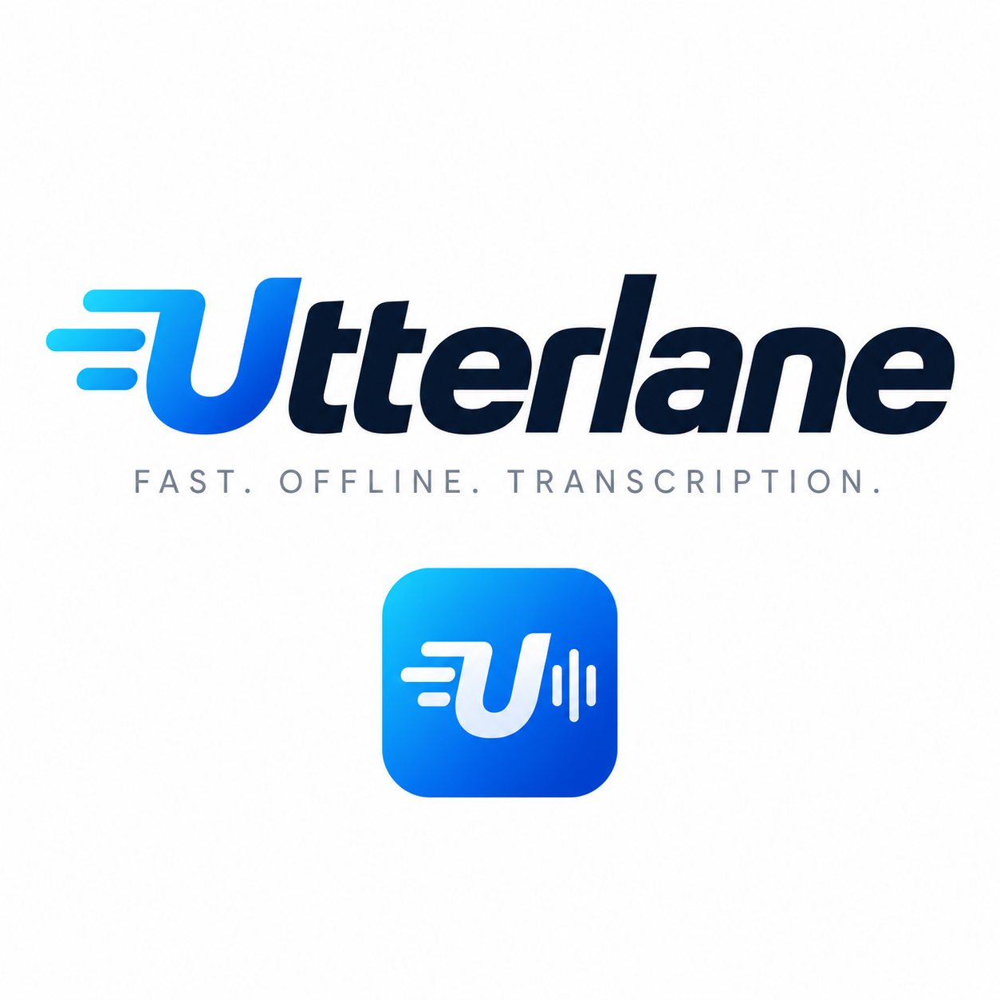

# Utterlane brand specification

Approved by Stephen Karl Larroque on 2026-10-04.

## Source artwork

`utterlane-logo-and-icon.png` is the original, unmodified artwork supplied by
Stephen Karl Larroque. Preserve it as the design reference. Generated assets
are derivatives, not replacements for this source. Its wordmark reads
**Utterlane** and its tagline is **FAST. OFFLINE. TRANSCRIPTION.**

The visual identity combines a cyan-to-blue gradient, an italic U with speed
lines, a waveform, and a navy wordmark. The README uses the supplied wordmark;
launcher and store icons use the supplied U-and-waveform symbol. Adaptive icons
must leave the foreground within Android's mask-safe area. Notification and
themed-launcher icons use a monochrome silhouette rather than a color bitmap.

## Application identity

- Public name and Gradle project: `Utterlane`.
- Application ID and Kotlin/Java namespace: `io.github.lrq3000.utterlane`.
- Application class: `UtterlaneApp`; Compose theme: `UtterlaneTheme`.
- Android styles: `Theme.Utterlane`; native library: `utterlane_crisp`.
- Project, support and release URLs: `https://github.com/lrq3000/Utterlane`.
- Maintainer: Stephen Karl Larroque <LRQ3000@GMAIL.COM>.

This is intentionally a separate Android application. Existing installations of
the upstream app do not transfer their settings, downloaded models, private
history, accessibility grants or keyboard registration automatically.
The GitHub repository rename must be performed separately for the new URLs.

## Attribution and history

Utterlane is a fork of [TranSlander](https://github.com/hatsch/TranSlander).
Preserve upstream copyright notices and real historical release URLs. Historical
QA results describe the application tested at the time; a rebrand must not claim
those results were obtained under the new application identity. Current build
instructions, source references and product descriptions use Utterlane.

The Apache-2.0 license is retained. Add Stephen Karl Larroque's copyright for
Utterlane contributions without replacing upstream ownership. AI contributions
are welcome when their outputs have been sanity checked by humans.
